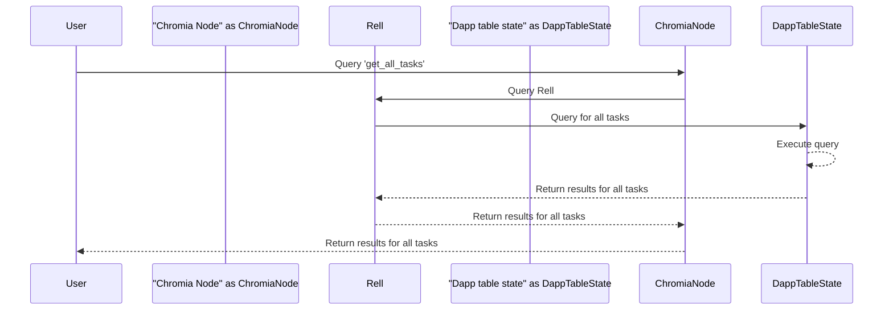
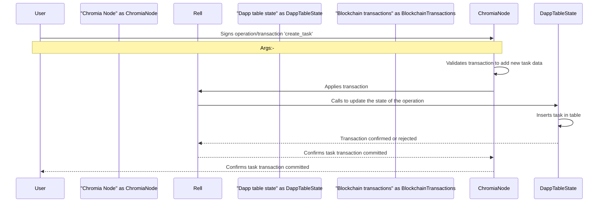
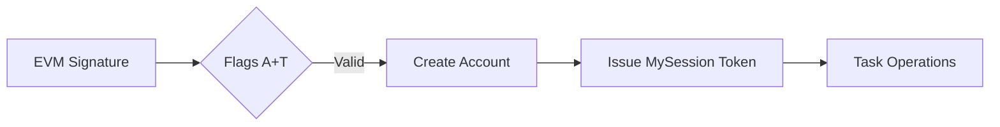
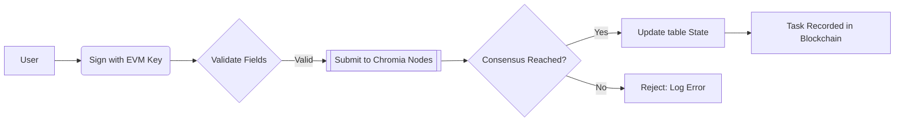
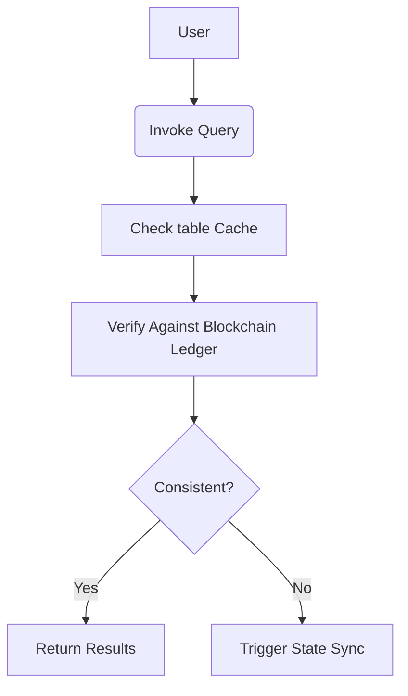

# To-Do App  
    

A blockchain-powered task management system ensuring **immutability**, **security**, and **transparency** via Chromia.  

---

## **Table of Contents**  
- [Overview](#overview)  
- [Installation](#installation)  
- [Architecture](#architecture)  
- [Smart Contract (Backend)](#smart-contract-backend)  
- [Frontend](#frontend)  
- [Security](#security)  
- [Testing](#testing)  
- [Deployment](#deployment)         
- [Acknowledgements](#acknowledgements)
- [Contact](#contact)

---

## **Overview**  
### **Purpose**  
A decentralized application (dApp) for managing tasks on the Chromia blockchain, designed to:  
- Ensure **data integrity** through immutable ledger storage.  
- Provide **end-to-end security** via cryptographic authentication.  
- Enable **cross-chain interoperability** for future extensibility.  

### **Key Features**  
| Feature | Description |  
|---------|-------------|  
| **User Registration** | Secured by Chromia’s `ft4` auth descriptors (multi-sig/EVM-compatible). |  
| **Task CRUD** | Create, Read, Update, Delete tasks with blockchain-verified ownership. |  
| **Rate Limiting** | Prevents spam with 10 transactions/minute per account. |  
| **Cross-Chain Readiness** | Built to support future cross-chain transfers. |  

### **Target Audience**  
- **Developers**: Explore blockchain integration patterns.  
- **End Users**: Manage tasks in a trustless, decentralized environment.  

---

## **Installation**  
### **Prerequisites**  
- Node.js v18+  
- PostgreSQL v16.3+  
- Docker (for local node setup)  
- Chromia CLI (`chr`)
- cheeck for installation on the chromia official website using the link below

```bash
  https://docs.chromia.com/intro/installation/

```

### **Backend Setup**  
1. Clone the repository:  
   ```bash  
   git clone https://github.com/NahomKeneni/rell_backend.git  
   cd rell_backend  
   ```  
2. Install dependencies:  
   ```bash  
   chr install   
   ```  
3. Start PostgreSQL via Docker:  
   ```bash  
   docker-compose up -d  
   ```  
   remember:- To run docker-compose up -d successfully, users must stop any local PostgreSQL service first. Otherwise, it may result in a "connection refused" error.

4. Deploy the smart contract:  
   ```bash  
   chr node start  
   ```  

### **Frontend Setup**  
1. Clone the frontend repository:  
   ```bash  
   git clone https://github.com/NahomKeneni/front_end.git  
   cd front_end 
   ```  
2. Install dependencies:  
   ```bash  
    npm install
    pnpm install  
    npm install @chromia/ft4@0.8.0  
   ```  
3. Run the development server:  
   ```bash  
   npm run dev  
   ```  

---

## **Architecture**  
### **System Workflow**  



---
## **Project Structure**  
### **Repository Layout for rell_backend**  

```bash  
dapp-backend/  
├── docker-compose.yml        # PostgreSQL container configuration  
├── package.json              # Node.js dependencies and scripts  
├── chromia.yml               # Chromia blockchain network settings  
├── src/  
│   ├── development.rell      # Development environment setup  
│   ├── main.rell             # Primary module imports and initialization  
│   ├── registration/         # EVM-compatible user registration system  
│   │   ├── module.rell       # User account creation logic  
│   │   └── test/            # Registration test suite  
│   ├── test/                # End-to-end test framework  
│   └── to_do/               # Core task management logic  
│       ├── auth.rell         # FT4 session authentication handlers  
│       ├── dto.rell          # Data transfer object schemas  
│       ├── model.rell        # Database entity definitions  
│       ├── module.rell       # Dependency injection and module linking  
│       ├── operations.rell   # CRUD operations for tasks  
│       └── queries.rell      # Task query system with filters  
```  

### **File Responsibility Matrix**  
| File/Directory              | Type       | Key Responsibilities                              |  
|-----------------------------|------------|---------------------------------------------------|  
| `docker-compose.yml`        | Config     | PostgreSQL container setup, port mapping, volumes, encoding |  
| `chromia.yml`               | Config     | Blockchain node settings, FT4 auth configurations |  
| `src/to_do/operations.rell` | Code       | Task lifecycle management (create/update/delete)  |  
| `src/registration/test/`    | Test       | EVM signature validation and account creation     |  
| `src/test/to_do_project_test.rell` | Test | Full task lifecycle and query validation          |  


---

## **Core Components**  

### **Data Models**  

The relationship between the user and task entities is a one-to-many relationship, where:-
  One user can own multiple tasks, meaning each task is associated with a single user (the task owner).
  This is established by referencing the user's unique identifier (user_id) in the task entity using the index user field.

#### **User Entity (`src/to_do/model.rell`)**  
```rell  
entity user {  
    key user_id: byte_array;     // Unique identifier (EVM address hash)  
    mutable name: text;          // Display name (max 50 characters)  
    key account;                 // Linked FT4 account (foreign key)  
}  
```  

| Field   | Type       | Properties | Description                   |
| ------- | ---------- | ---------- | ----------------------------- |
| user_id | byte_array | key        | Unique identifier for user    |
| name    | text       | mutable    | User's name                   |
| account | account    | key        | Associated blockchain account |
#### **Task Entity (`src/to_do/model.rell`)**  
```rell  
entity task {  
    index user;                  // Task owner reference  
    key task_id: byte_array;     // UUIDv4 identifier  
    mutable task_title: text;    // Task name (non-empty)  
    mutable task_description: text?; // Optional details  
    mutable due_date: timestamp; // Deadline (future timestamp)  
    mutable is_completed: boolean = false;  
    created_at: timestamp = op_context.last_block_time;  
    mutable updated_at: timestamp = op_context.last_block_time;  
}  
```  

| Field            | Type       | Properties                   | Description                |
| ---------------- | ---------- | ---------------------------- | -------------------------- |
| user             | user       | index                        | Reference to user entity   |
| task_id          | byte_array | key                          | Unique identifier for task |
| task_title       | text       | mutable, key                 | Title of the task          |
| task_description | text       | mutable, key                 | Description of the task    |
| is_completed     | boolean    | mutable, default: false      | Task completion status     |
| created_at       | timestamp  | default: block_time          | Task creation timestamp    |
| updated_at       | timestamp  | mutable, default: block_time | Last update timestamp      |
| due_date         | timestamp  | mutable                      | Task due date              |
| to_date          | timestamp  | mutable, default: block_time | Task target date           |
#### **Task DTO (`src/to_do/dto.rell`)**
```rell
struct task_dto {
    task_id: byte_array;
    task_title: text;
    task_description: text;
    due_date: timestamp;
    is_completed: boolean;
    created_at: timestamp;
    updated_at: timestamp;
} 
```

| Field            | Type       | Properties | Description             |
| ---------------- | ---------- | ---------- | ----------------------- |
| task_id          | byte_array | -          | Task identifier         |
| task_title       | text       | -          | Title of the task       |
| task_description | text       | -          | Description of the task |
| due_date         | timestamp  | -          | Task due date           |
| is_completed     | boolean    | -          | Completion status       |
| created_at       | timestamp  | -          | Creation timestamp      |
| updated_at       | timestamp  | -          | Last update timestamp   |

---

### **Authentication & Authorization**  
#### **FT4 Session Flags**  


| Flag         | Scope                     | Granting Mechanism                    |  
|--------------|---------------------------|---------------------------------------|  
| **A**        | Account Creation          | `single_sig_auth_descriptor()` in `registration_test.rell` |  
| **T**        | Task Management           | FT4 account strategy in `module.rell` |  
| **MySession**| CRUD Operations           | `auth.add_auth_handler()` in `auth.rell` |  

#### **Auth Handler Implementation (`src/to_do/auth.rell`)**  
```rell  
@extend(auth.auth_handler)  
function () = auth.add_auth_handler(  
    flags = ["MySession"],  // Session permissions  
    strategy = auth.strategy.session_based()  
)  
```  

---

### **Task Operations**  
#### **Operation Specifications (`src/to_do/operations.rell`)**  

| Operation        | Parameters                                  | Validation Rules                     |  
|------------------|---------------------------------------------|---------------------------------------|  
| `create_task`    | `user_id`, `task_id`, `title`, `desc`, `due_date` | - Title non-empty<br>- `due_date` ≥ current block time |  
| `update_task`    | `task_id`, `new_title`, `new_desc`, `new_due`     | - Task exists<br>- User owns task    |  
| `delete_task`    | `task_id`                                   | - Valid task ID                      |  

#### **Transaction Flow**  


---

### **Query System**  
#### **Query Types (`src/to_do/queries.rell`)**  

| Query                      | Filters                       | Output Format (`task_dto`)       |     |
| -------------------------- | ----------------------------- | -------------------------------- | --- |
| `get_user_tasks`           | User ID                       | All tasks sorted by `due_date`   |     |
| `get_user_tasks_by_status` | User ID + `is_completed` flag | Filtered tasks with status match |     |
| `get_overdue_tasks`        | User ID + `due_date < now()`  | Incomplete tasks past deadline   |     |

#### **Query Workflow**  


---
## **Smart Contract (Backend)**  
### **Core Modules**  
1. **Authentication (`auth.rell`)**  
   ```rell  
   operation create_user(name: text, auth_descriptor: auth_descriptor) {  
     require(name.length > 0, "Invalid name");  
     create user(name, auth_descriptor);  
   }  
   ```  
   - Validates EVM signatures and multi-sig policies.  

2. **Task Operations (`operations.rell`)**  
   - Enforces ownership checks for task updates/deletes.  
 

---

## **Frontend**  
### **Component Structure**  
| Component | Purpose |  
|-----------|---------|  
| `register/page.tsx` | EVM wallet-based user registration |  
| `useTodos.ts` | Manages task state with localStorage sync |  
| `TodoItem.tsx` | Renders task cards with edit/delete actions |  

### **Authentication Flow**  
1. User signs in via MetaMask.  
2. Frontend submits signature to Chromia for verification.  
3. Session token stored in `localStorage` upon success.  

---

## **Security**  
### **Protocols**  
- **Input Validation**: Rejects empty/malformed payloads.  
- **Rate Limiting**: `rl_state` enforces 10 TX/minute per account.  
- **Auth Descriptors**: Multi-sig policies for critical operations.  

---


## **Testing**  
### **Backend Tests**  
```bash  
chr test  # Runs unit tests for smart contracts  Running tests for chain: to_do_project

# if it is working correctly the test result will be as follows

# TEST: registration.test.regestration_test:test_evm_registration
# OK: registration.test.regestration_test:test_evm_registration (13.373s)
# TEST: test.to_do_project_test:test_create_entities
# OK: test.to_do_project_test:test_create_entities (9.683s)
# TEST: test.to_do_project_test:test_get_user_tasks_by_status
# OK: test.to_do_project_test:test_get_user_tasks_by_status (1.671s)
# TEST: test.to_do_project_test:test_get_overdue_tasks
# OK: test.to_do_project_test:test_get_overdue_tasks (1.682s)

# ------------------------------------------------------------------------
# TEST RESULTS:

# OK registration.test.regestration_test:test_evm_registration (13.373s)
# OK test.to_do_project_test:test_create_entities (9.683s)
# OK test.to_do_project_test:test_get_user_tasks_by_status (1.671s)
# OK test.to_do_project_test:test_get_overdue_tasks (1.682s)

# SUMMARY: 0 FAILED / 4 PASSED / 4 TOTAL (26.411s)


# ***** OK *****

```  
**Key Test Cases**:  
- Invalid auth descriptor rejection.  
- Task creation with empty title prevention.  

### **Frontend Tests**  
```bash  
npm run cypress  # Launches E2E test suite  
```  

---

## **Deployment**  
### **Steps**  

more detail will be found here using the following link form chromia official website
```bash
  https://docs.chromia.com/intro/deployment/frontend-application/

```

1. Start Chromia node and retrieve `blockchainRid`:  
   ```bash  
   chr node start --wipe  
   ```  
2. Update `.env`:  
   ```env  
   NEXT_PUBLIC_BRID=<blockchainRid>  
   ```  
3. Configure `next.config.js`:  
   ```javascript  
   const nextConfig = {  
     output: "export",  
     images: { unoptimized: true },  
     basePath: `/web_query/${process.env.NEXT_PUBLIC_BRID}/web_static`,  
   };  
   ```  
4. Build and deploy:  
   ```bash  
   pnpm build && chr node update  
   ```  
5. Access at:  
   ```  
   http://localhost:7740/web_query/<blockchainRid>/web_static  
   ```  


## Acknowledgements

I would like to express my heartfelt gratitude to the Chromia company for fostering my deep interest in blockchain development with Rell and Postchain. Their support, guidance, and comprehensive documentation have been instrumental in enhancing my understanding and passion for this exciting technology.

I am committed to staying updated with the company’s developments and will continue to explore and learn more from the extensive resources provided in their documentation. The opportunities and knowledge shared by Chromia have truly inspired me to delve deeper into blockchain development.

Thank you once again for your invaluable support and for sparking my enthusiasm for this field.

## Contact
Prepared by: Nahom Keneni
Education: Bahirdar-universty Ethiopia 
Level: 3rd year software engineering student
Email📧: nahomkeneni4@gmail.com
Email📧: diakonnahomnahom@gmail.com
